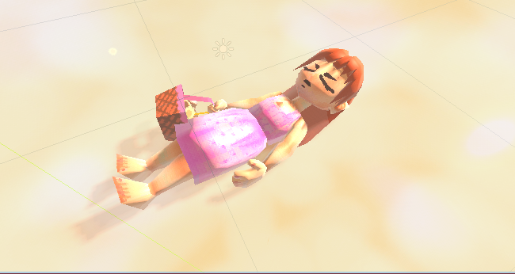
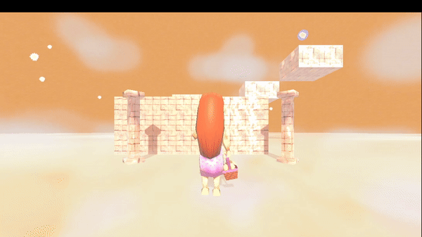

# GodotProgrammingLogicTutorial

## About
Prototype of a game used in a brazilian programming logic video tutorial i did as a project for Uninter. The experience of making video tutorials was great. Although the quality of my microfone was kinda bad i think i did a great thing for anyone looking to start using the game engine and learning the core fundamentals of programming logic.

Play it online: https://lucnesun.itch.io/dreamchase

Tutorial Playlist: https://www.youtube.com/watch?v=6ah2y7DFA7I&list=PLTXX9kH3Y0lPntl-Qf4W_UhVlCg4qSb-n

# How to use
    Just download the recent version of godot 4 in the official site and place the assets and sound in the root of the project folder before opening.
Godot 4 link: https://godotengine.org/

Assets and sounds link: https://www.mediafire.com/file/62cppbyxgmgjpyy/githubgodotassets.rar/file

# Project structure
### Assets and sound 
    they are the contents folders (3d models, textures and sounds). While modules and scenes are the 'code' part.
## Modules
### Bounce
    Example of ways to add extra functionality to the demo.
### Enemy
    A simple enemy that always runs to the player and reset the course when he attack.
### Enviro
    The visual effects that always follows the player
### Objectives
    They just float in one place waiting to be collected by the player
### Player
    Simple 3rd person character controller
### System
    Has a global script that manages the game session (responsible to reset the current scene when the enemy collides with the player). He keeps track of all the scenes of the game and iterate through them until the End. The ending scene resets all the game to the intro. 

